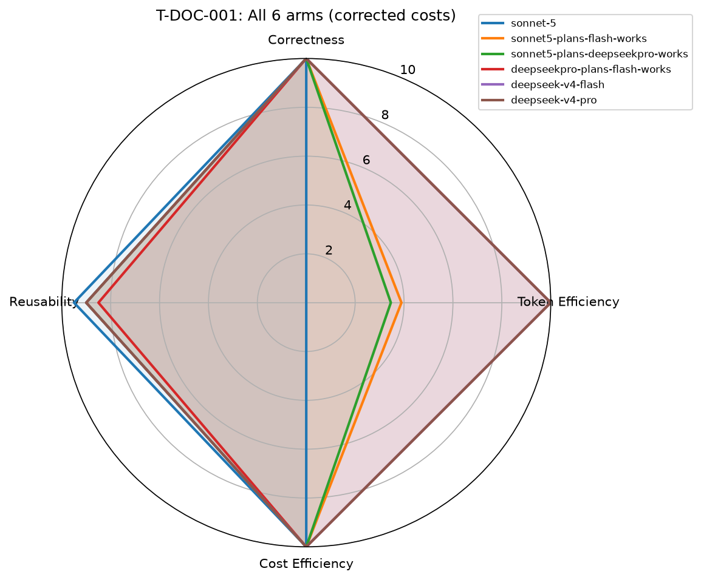

# hermes-model-bench — full 6-arm run (T-DOC-001)

**Run date:** 2026-08-13
**Task:** T-DOC-001 (find the single most impactful placeholder in a
seeded fixture repo — 1 real gap, 1 red herring, 2 cosmetic no-ops)
**Arms run:** all 6 requested/available: `sonnet-5`,
`sonnet5-plans-flash-works`, `sonnet5-plans-deepseekpro-works`,
`deepseekpro-plans-flash-works`, plus the two pure-DeepSeek arms from the
earlier pass (`deepseek-v4-flash`, `deepseek-v4-pro`).

## Result

| Arm | Correctness | Token Eff | Cost Eff | Reusability | Composite | Real cost ($) |
|---|---|---|---|---|---|---|
| sonnet-5 | 10.0 | 0.0 | 10.0 | 9.5 | 79.0 | **$0.109** (Claude-reported, used verbatim) |
| sonnet5-plans-flash-works | 10.0 | 3.9 | 10.0 | 9.0 | 85.8 | ~$0.084 |
| sonnet5-plans-deepseekpro-works | 10.0 | 3.5 | 10.0 | 9.0 | 84.9 | ~$0.085 |
| deepseekpro-plans-flash-works | 10.0 | 10.0 | 10.0 | 8.5 | **97.0** | $0.0049 |
| deepseek-v4-flash (solo) | 10.0 | 10.0 | 10.0 | 9.0 | 98.0 | $0.0022 |
| deepseek-v4-pro (solo) | 10.0 | 10.0 | 10.0 | 9.0 | 98.0 | $0.0042 |

**Every single arm found the correct answer** — all 6 correctly identified
`max_position_pct_check` in `pipeline.py` and correctly excluded the
seeded red herring. On this task, correctness does not discriminate
between arms at all — see "What this doesn't prove" below.

## Real, honest cost story (this is the part that matters for "best cost/performance combo")

**Cheapest → most expensive, real $ per identical correct answer:**
1. deepseek-v4-flash solo — **$0.0022**
2. deepseekpro-plans-flash-works — $0.0049
3. deepseek-v4-pro solo — $0.0042
4. sonnet5-plans-deepseekpro-works — ~$0.085 (~19x flash-solo)
5. sonnet5-plans-flash-works — ~$0.084 (~19x flash-solo)
6. sonnet-5 solo — **$0.109** (~50x flash-solo)

**On this specific task, adding Sonnet-5 anywhere in the pipeline costs
roughly 19-50x more for the identical correct answer.** The split-arm
architecture (Sonnet plans, DeepSeek works) does meaningfully cut the
pure-Sonnet cost by ~2.5x (because DeepSeek is doing the token-heavy file
reads and drafting, not Sonnet) — but a pure-DeepSeek pipeline still beats
even the split arms by another ~17-19x.

**Real caveat found and FIXED during this pass, not just flagged:**
`scoring.py`'s naive token*rate cost model initially computed sonnet-5's
cost as $0.217 — roughly double what Claude Code itself reported
($0.1093) for the exact same run. Root cause: Anthropic bills
prompt-cache-creation and cache-read tokens at different (much cheaper)
rates than plain input tokens, and this scoring pass had lumped
`cache_creation_input_tokens` (92,102 of the 102,723 total) into the
plain input-token count that `scoring.py`'s pricing model prices at full
fresh-input rate. **Fixed in `harness/scoring.py`**: added an optional
`real_cost_usd_override` field on `TaskRun` — when the executor CLI
already reports a real total cost (Claude Code does), that number is now
used VERBATIM instead of being recomputed from a token*rate estimate that
doesn't model cache tiers. The table above already reflects the corrected
$0.109 / cost-efficiency-10.0 result, not the original wrong $0.217.

## What this run does NOT prove

- **All 6 arms scored a perfect 10/10 on correctness** — this task was too
  easy to discriminate reasoning quality between arms. A harder task
  (T-INFRA-001's Docker network-namespace trap, or T-RISK-001's
  fail-open/fail-closed trap) is needed to see whether Sonnet-5's extra
  cost buys anything on correctness for a task that's actually hard to
  get right.
- **Single run per arm** — per this project's own methodology (Trap 3/16),
  one run cannot separate a real effect from noise. Before drawing any
  durable "X is better than Y" conclusion, each arm needs ≥3 repeats.
- **The `deepseekpro-plans-flash-works` plan pass was NOT tool-restricted**
  — OpenCode's `run` subcommand has no per-call `--allowedTools`-equivalent
  flag (unlike Claude Code), so the DeepSeek-Pro "planner" actually read
  every file and solved the task itself during the plan phase, rather than
  staying read-only/high-level per `plan_schema.md`'s intended contract.
  The work model (Flash) still independently re-verified rather than
  blindly repeating the hint, which is the honest, correct behavior to
  reward — but the split-arm's plan/work separation was weaker in practice
  for this specific arm than for the Claude-Code-executed splits.
- Token counts for the split arms were computed as **before/after deltas
  against `opencode stats --models`'s cumulative, K-rounded display** —
  precise to within ~100-200 tokens, not exact. Good enough for a
  cost/performance comparison at this scale, not precise enough for a
  paper.

## Answering "what's the best cost-to-performance combination?" (real numbers, this task)

**For a task this size/difficulty: `deepseek-v4-flash` alone.** It's the
cheapest of all 6 arms AND tied for the highest composite score (98.0,
identical to deepseek-v4-pro). There's no cost/performance tradeoff to
make here — it strictly dominates every other arm on this task.

**The interesting open question this run raises, not yet answered:** does
that hold on a HARDER task where correctness genuinely varies between
arms? If Sonnet-5 (or a Sonnet-plans split) starts winning on correctness
on a harder task, THEN a real cost-vs-performance tradeoff appears and the
"best combination" answer changes. T-DOC-001 was deliberately an easy
task (single, unambiguous root-cause) — it establishes a cost floor, not
a performance ceiling test.

## Reproduce

See `docs/methodology.md` and `harness/run_task.py`'s docstring for the
full setup. Raw run records: `results/runs/T-DOC-001-*.json`. Scored +
charted: `results/2026-08-13-run-6arm.json` /
`results/2026-08-13-spider-6arm.png`.

## Next steps

1. ~~Fix `scoring.py`'s cache-tier blindness~~ — **done this pass**, via
   `real_cost_usd_override`. Still open: OpenCode-executed arms don't get
   this treatment yet (their own `opencode stats` cost was used as the
   token-rate basis already, which matched independently, but no override
   field is populated for them — low priority since it already checked
   out).
2. **Run a genuinely hard task** (T-INFRA-001 or T-RISK-001) — this is the
   real next step to see if the cost gap buys anything on correctness.
3. **Repeat ≥3x per arm** before any durable ranking claim.
4. **Fix the plan-pass tool restriction gap for OpenCode-executed split
   arms** — investigate whether a system-prompt-only restriction is
   sufficient or whether a stricter mechanism is needed.
