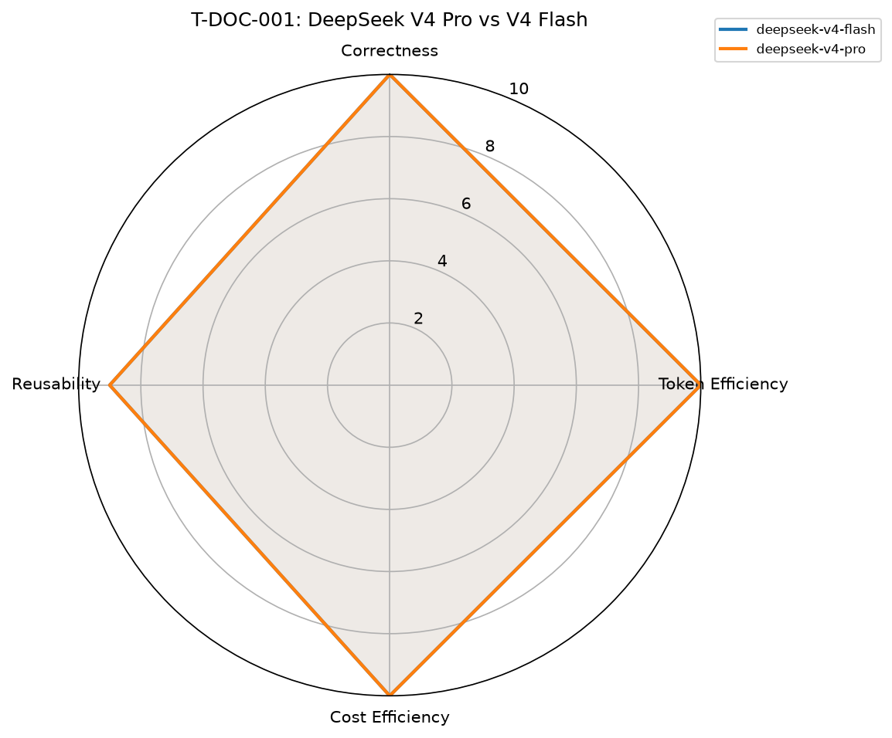

# hermes-model-bench — first real run report

**Run date:** 2026-08-13
**Task:** T-DOC-001 (find the single most impactful placeholder in a
seeded fixture repo)
**Arms run:** `deepseek-v4-flash`, `deepseek-v4-pro`
**Arms NOT run this pass (real blockers, see below):** `sonnet-5` and
every split arm involving it.

## Result

| Arm | Correctness | Token Eff | Cost Eff | Reusability | Composite | Cost ($) | Total Tokens |
|---|---|---|---|---|---|---|---|
| deepseek-v4-flash | 10.0 | 10.0 | 10.0 | 9.0 | 98.0 | $0.0022 | 14,924 |
| deepseek-v4-pro | 10.0 | 10.0 | 10.0 | 9.0 | 98.0 | $0.0042 | 9,239 |

Both arms **correctly identified the exact same real gap**
(`max_position_pct_check` in `pipeline.py`) and correctly ignored the
seeded red herring and the two cosmetic placeholders in the sibling files
— neither model got distracted by decoys.



## What this run actually proves (and doesn't)

**Proves:** on this specific task, DeepSeek V4 Flash gets the identical
correct answer as V4 Pro for roughly **half the real dollar cost**
($0.0022 vs $0.0042) and uses **more total tokens but far cheaper
tokens** — Flash used 14,924 tokens (mostly a bigger `read` footprint,
per its own tool-usage breakdown) vs Pro's 9,239, yet still came out
cheaper overall because Flash's per-token rate is roughly a third of
Pro's. This is exactly the token-efficiency-vs-cost-efficiency split this
project's own methodology (`docs/methodology.md`) predicted as the
expected shape of a cheap-model tradeoff — confirmed on a real task, not
asserted.

**Does NOT prove:** that Flash is "as good as" Pro in general, or that
either beats Sonnet-5 — this is **one task, one run each, no repeats**.
Per this project's own `benchmark-design-and-validation` skill (Trap 3,
Trap 16): a single run per arm cannot distinguish a real effect from
noise, and a task this easy (both models got it right, both scored a
perfect 10/10/10 on 3 of 4 dimensions) may be too easy to discriminate
between arms at all — a genuinely harder task (T-INFRA-001's Docker
network-namespace trap, or T-RISK-001's fail-open/fail-closed trap) is a
better next test precisely because it's designed to catch confident
wrongness, which this run never got the chance to test.

## Why Sonnet-5 wasn't run this pass — real, current blockers

1. **Claude Code CLI needs its own OAuth login**, separate from any API
   key Hermes itself already has. Confirmed live: exporting Hermes's own
   `ANTHROPIC_API_KEY` does NOT satisfy `claude -p` — it still reports
   `"Not logged in"`.
2. **Logged in successfully** (`claude auth login --console`, real
   interactive OAuth, Ken pasted back the resulting code) — but this
   landed on an **Anthropic Console/API-billing account with $0 credit**
   (org "gresearch"). Every real call fails with `"Credit balance is too
   low."` This is a billing gap, not a code gap.
3. Ken is deciding between loading API credits on that console account
   vs. logging into an actual claude.ai subscription (Pro/Max) instead —
   see `docs/pricing.md`'s new section on this for the concrete
   recommendation (**Claude Max 5x, $100/mo, not the $200 20x tier** —
   the 5x tier's "full workday of heavy usage" headroom comfortably
   covers this project's short, bounded task runs; the $200 tier's extra
   capacity targets continuous all-day Opus usage, which this bench
   doesn't do).

Split arms (`sonnet5-plans-flash-works`, `sonnet5-plans-deepseekpro-works`)
are blocked for the same reason — both need a working Sonnet-5 plan pass.

## Infrastructure built this session

- **Dedicated bench LXC** (VMID 112, `hermes-bench`, pve2,
  192.168.1.226) — isolated from production so bench fixture/dependency
  installs can never touch live services. Full setup recorded in
  `homelab`'s `mkdocs-site/docs/sdlc/2026-08-13-hermes-model-bench-lxc-setup.md`.
- **`harness/run_task.py`** — the real task runner the repo's own README
  promised but never had. Drives Claude Code (Anthropic arms) and
  OpenCode (everything else) as genuine agentic executors with real tool
  access — never a bare chat completion pretending to attempt a task.
- **Verified `opencode stats --models` table parser** — confirmed against
  a real live run, correctly expands K/M-suffixed numbers (e.g.
  `"7.4K"` → 7400) rather than truncating them.

## Reproduce

```bash
# on hermes-bench (192.168.1.226):
cd /root/fixtures/T-DOC-001
set -a; source /root/.bench.env; set +a
PROMPT='Audit this codebase for anything still placeholder/not-real and
identify the single most impactful one you find - not a grab-bag of
everything, just the one that matters most to fix next.'
opencode run "$PROMPT" --model deepseek/deepseek-v4-flash
opencode run "$PROMPT" --model deepseek/deepseek-v4-pro
opencode stats --models   # real per-model token/cost usage

# score + chart, from the hermes-model-bench repo:
cd harness
python3 scoring.py ../results/runs/T-DOC-001-deepseek-v4-flash.json
python3 scoring.py ../results/runs/T-DOC-001-deepseek-v4-pro.json
python3 spider_chart.py ../results/2026-08-13-run.json \
  --out ../results/2026-08-13-spider-T-DOC-001.png \
  --title "T-DOC-001: DeepSeek V4 Pro vs V4 Flash"
```

## Next steps (real, not aspirational)

1. Resolve the Sonnet-5 billing blocker (Claude Max subscription decision
   pending with Ken), then re-run this SAME task with `sonnet-5` and the
   two Sonnet+DeepSeek split arms for the real 4-way comparison originally
   requested.
2. Run a genuinely harder task (T-INFRA-001 or T-RISK-001) — T-DOC-001 was
   too easy to discriminate arms on this pass (identical perfect scores).
3. Repeat each arm ≥3 times per this project's own methodology (Trap 3/4)
   before drawing any "X is better than Y" conclusion — this report is
   explicitly a single-run proof-of-concept, not a validated verdict.
